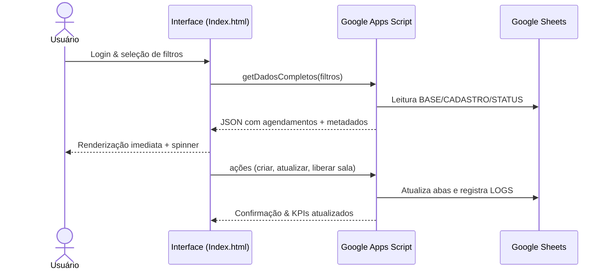

# 📘 Sistema de Agendamento de Salas

> Guia visual conciso para compreender como o front-end em HTML/CSS/JS se integra ao backend em Google Apps Script e à planilha do Google Sheets.

---

## ✨ Visão em um relance

| Pilar | Destaques |
| --- | --- |
| **Propósito** | Gerenciar reservas de salas por ilhas, turnos e especialidades com dashboards, filtros dinâmicos e indicadores de ocupação. |
| **Stack** | UI single-page (`Index.html`) com tema dark/light e gráficos Chart.js → Apps Script (`CODE.gs`) → planilha (`BASE`, `CADASTRO`, `STATUS_SALAS`, `USUARIOS`, `LOGS`). |
| **Fluxo base** | Usuário acessa painel → aplica filtros → dados são buscados do Apps Script → UI renderiza listas, cards e gráficos → ações escrevem logs. |
| **Segurança** | Autenticação por matrícula/senha (hash) na aba `USUARIOS`, cache de 30s, logs detalhados por e-mail de usuário. |

---

## 🧭 Jornada do usuário

---

## 🧩 Componentes principais

### Front-end (`Index.html`)

- **Tema e Layout**: CSS com variáveis para modo escuro/claro, sombras e cartões responsivos.
- **Dashboard**: cards de ocupação, heatmaps e gráficos (Chart.js) para visão rápida.
- **Planejamento**: tabela dinâmica com filtros por ilha, sala, turno, status e categoria.
- **Interação**: botões com indicadores de processamento, drawer lateral para filtros avançados e modais de detalhamento.
- **Experiência**: spinner exibido enquanto dados são buscados, garantindo feedback imediato.

### Backend (`CODE.gs`)

| Bloco | Responsabilidade |
| --- | --- |
| Constantes de colunas | Mapeiam posições das colunas nas abas da planilha para objetos estruturados. |
| Normalização | Funções `normalizarTextoServidor`, `normalizarTurnoServidor`, `normalizarStatusServidor` padronizam filtros. |
| Cache | Google CacheService com duração de 30s para respostas frequentes. |
| Logs | `registrarLog` escreve na aba `LOGS` com usuário, ação, detalhes e JSON. |
| Filtros | `agendamentoCorrespondeFiltros` aplica múltiplos critérios (turno, status, ilhas, salas, categorias, profissionais). |
| Métricas | Funções derivadas calculam ocupação, contagem por status e séries para dashboards. |
| Ações | Criação/edição de agendamentos, atualização de status de salas e relatórios exportáveis (CSV/JSON). |

---

## 🗂 Estrutura da planilha

| Aba | Função | Colunas-chave |
| --- | --- | --- |
| `BASE` | Registro bruto das reservas | `ILHA`, `SALA`, `DATA1/2`, `TURNO`, `ESPECIALIDADE`, `PROFISSIONAL`, `STATUS`, `HORA1/2` |
| `CADASTRO` | Valores de referência | `ESPECIALIDADES`, `CATEGORIAS`, `ILHAS` |
| `STATUS_SALAS` | Estado atual das salas | `SALA`, `STATUS`, `MOTIVO`, `DATA_ATUALIZACAO`, `USUARIO` |
| `USUARIOS` | Controle de acesso | `MATRICULA`, `NOME`, `SETOR`, `SENHA_HASH`, `ROLE` |
| `LOGS` | Auditoria | `TIMESTAMP`, `USUARIO`, `ACAO`, `DETALHES`, `DADOS_JSON` |

---

## 🔄 Fluxos operacionais

1. **Consulta de agenda**
   - UI solicita dados com filtros → Apps Script busca na `BASE`, aplica `agendamentoCorrespondeFiltros` e retorna.
   - Ocupação é calculada com base em `TOTAL_SALAS_ESTIMADO` e exibida em cards.
2. **Agendamento / edição**
   - Formulário envia payload → Apps Script valida disponibilidade, grava na `BASE` e adiciona log.
3. **Status das salas**
   - Alterações são refletidas na aba `STATUS_SALAS`, permitindo monitorar bloqueios/manutenções.
4. **Relatórios e dashboards**
   - Apps Script consolida séries (por turno, especialidade, ilha) e retorna ao front para gráficos.

---

## 🛡️ Segurança, confiabilidade e suporte

- **Autenticação**: validação contra `USUARIOS` com senhas hash e perfis (`ROLE`).
- **Autorização**: regras no Apps Script restringem ações críticas a administradores.
- **Logs e auditoria**: todas as ações relevantes gravadas com timestamp e usuário ativo.
- **Recuperação**: os dados residem na planilha, facilitando backup e restauração.
- **Alertas**: e-mail do administrador (`ADMIN_EMAIL`) pode ser usado para notificações críticas.

---

## 📈 KPIs monitorados

- Taxa de ocupação por período e ilha.
- Distribuição por especialidade/categoria.
- Volumetria por turno (manhã, tarde, noite, integral).
- Tempo médio de permanência (hora de chegada vs. saída real).
- Status das salas (livre, reservado, bloqueado, manutenção).

---

## 🚀 Como evoluir

- Integrar com calendários externos (Google Calendar) para sincronização bidirecional.
- Adicionar fluxo de aprovação para reservas sensíveis.
- Disponibilizar API REST externa (Apps Script Web App) com tokens de serviço.
- Criar testes automatizados (Jest/Clasp) para funções críticas do Apps Script.

---

> 📩 Dúvidas ou melhorias? Consulte o código-fonte em `Index.html` e `CODE.gs` para detalhes de implementação.

